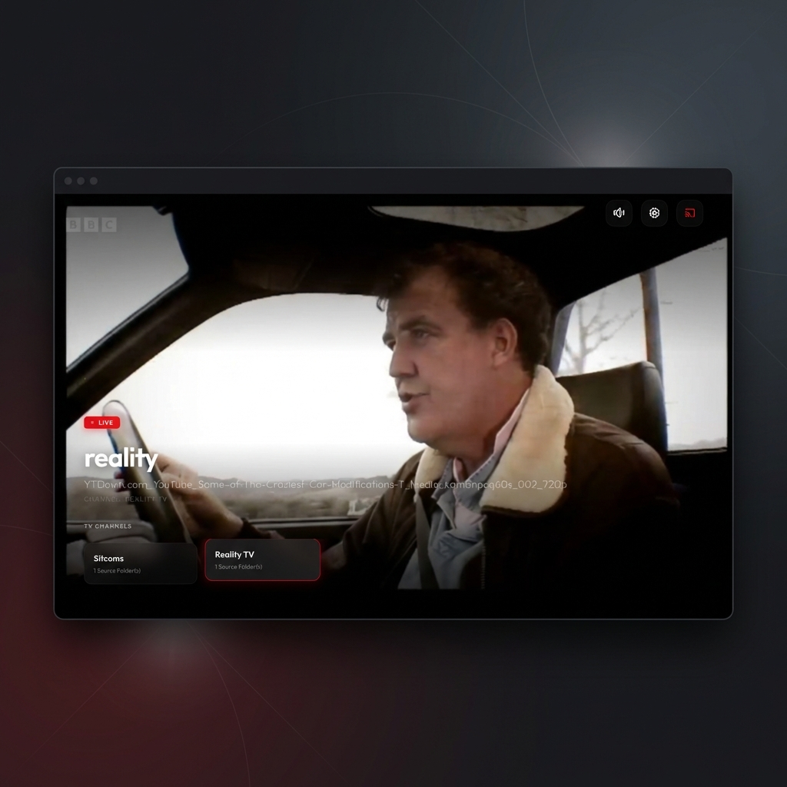
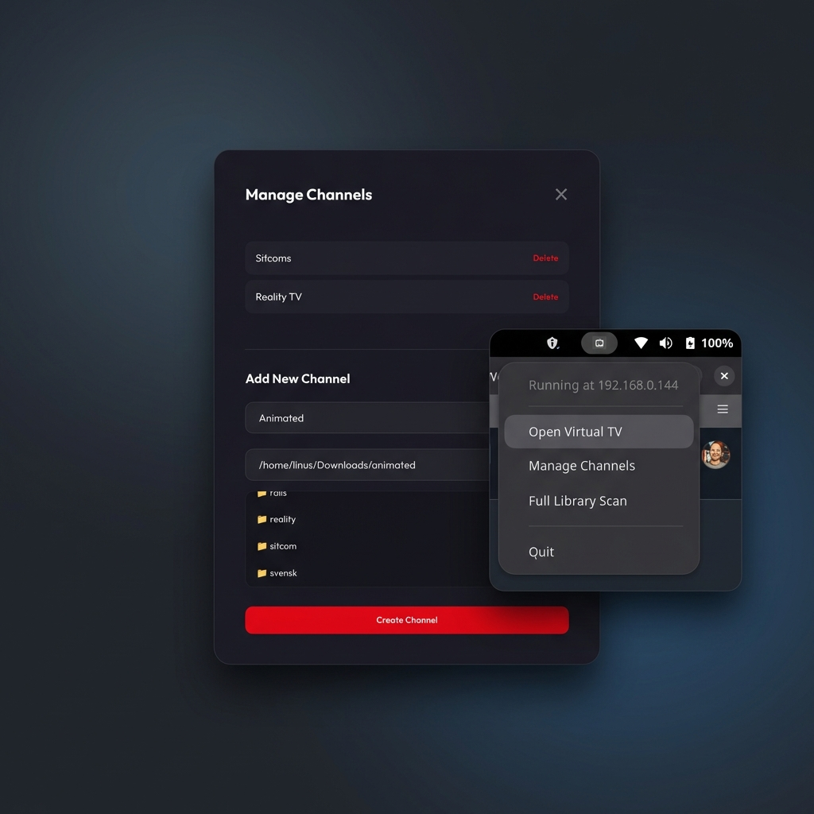

# Virtual TV v0.2.2

Transform your local media collection into a endless randomized stream so it
feels like watching TV from the 90s/00s.

## Features

- **Synced Global Playback**: Everyone on your network sees the same frame, just like real TV.
- **Chromecast Support**: Beam channels to your TV with full progress syncing.
- **Simple management**: Manage channels effortlessly through the web UI.

## Quick Start

1. Download the binary for your platform (`virtual-tv` or `virtual-tv.exe`).
2. Run the file.
3. The app will appear in your **System Tray**.
4. Right-click the tray icon and select **Open Virtual TV** or go to `http://<YOUR-IP>:9210`.

### Headless Mode (Server)

If you are running on a Linux server without a desktop environment, use the `--headless` flag to run without the tray icon:

```bash
./virtual-tv --headless
```

### Linux Service (systemd)

To keep Virtual TV running in the background on your server, create a service file:

`/etc/systemd/system/virtual-tv.service`
```ini
[Unit]
Description=Virtual TV Server
After=network.target

[Service]
ExecStart=/usr/local/bin/virtual-tv --headless
WorkingDirectory=/home/youruser/virtual-tv
User=youruser
Restart=always

[Install]
WantedBy=multi-user.target
```

Then run:
```bash
sudo systemctl enable --now virtual-tv
```

## Reverse Proxy & Authentication

Virtual TV is designed to be simple and lightweight. Out of the box, it serves content directly on port 9210. 

If you want to expose this to the internet with **SSL (HTTPS)**, **Custom Domains**, or **Basic Auth**, I highly recommend using a reverse proxy like [Caddy](https://caddyserver.com/). It handles SSL automatically and is very easy to configure.

Example `Caddyfile`:
```css
tv.yourdomain.com {
    reverse_proxy localhost:9210
}
```

## Screenshots






## Chromecast Setup

If you don't use a reverse proxy, and opt for the http protocol, then you have to enable unsafe origins in your browser. Browsers block storage on local IP addresses. To use Chromecast, you must trust your computers IP:

1. Open Chrome/Edge and go to: `chrome://flags/#unsafely-treat-insecure-origin-as-secure`
2. Add your server's network address (e.g., `http://192.168.1.50:9210`).
3. Set the dropdown to **Enabled** and **Relaunch**.

*Note: Access the TV via your Network IP (found in the tray menu) when you want to cast.*
